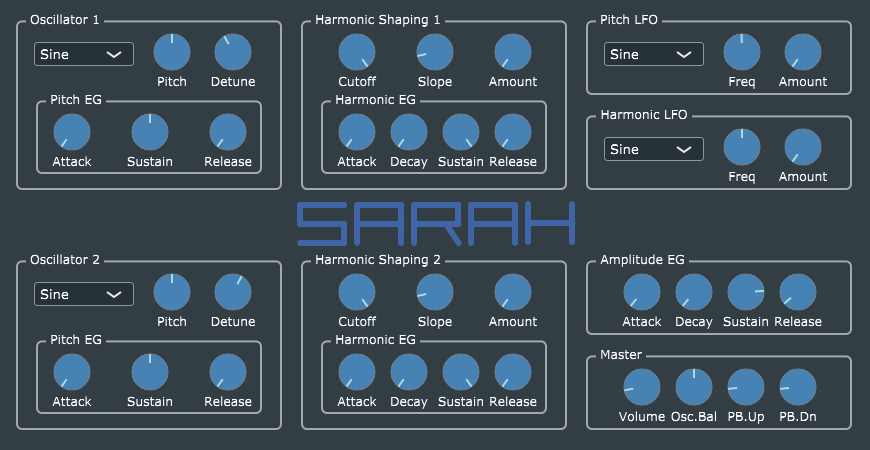

# SARAH #
**SARAH** (*Synthèse à Rapide Analyse Harmonique*, or Synthesis with Fast Harmonic Analysis) is music synthesizer plug-in built using [JUCE 5.1.2](https://www.juce.com/), and taking advantage of its newly-added DSP (digital signal processing) capabilities.

**SARAH** is an improved and expanded version of [VanillaJuce](https://github.com/getdunne/VanillaJuce) which uses the new DSP classes added in JUCE 5 to address the problem of oscillator aliasing. It works by using *juce::dsp::FFT* to transform mathematically-perfect oscillator waveforms, zeroing out unwanted high-frequency harmonics, and reverse-transforming to produce perfectly band-limited wave tables. Just for fun (and because I wanted to know if it was even possible without killing the CPU), it also implements simulated low-pass filtering in the frequency domain.

**SARAH** also illustrates how to build a conventional single-page editor GUI using standard JUCE graphics plus customized look-and-feel for traditional-looking knob controls. A limited "skinning" capability is provided, through use of a pre-rendered background image ([which can be user-specific](Skinning/README.md)).

## Implementation notes ##
This code has been compiled successfully using [Microsoft Visual Studio 2017, Community Edition](https://www.visualstudio.com/community) and [Apple Xcode](https://developer.apple.com/xcode/) v8.2.1. I have tested the VST2.x build under Windows 10 64-bit using the 64-bit version of Hermann Seib's [VSTHost](http://www.hermannseib.com/english/vsthost.htm), and the Mac AUv2 build under [Apple Logic Pro X](https://www.apple.com/ca/logic-pro/what-is/) v10.3.2. I have not tested the Mac VST2.x build. I have not attempted to create a Linux VST build.

I welcome feedback on the [JUCE Forum](https://forum.juce.com/), where you can find me as user **getdunne**.

## Skinning ##
The latest version of SARAH allows use of a user-supplied background image or "skin" file. See [here](Skinning/README.md).

## Detailed documentation ##

[Go here for more detailed information](http://getdunne.net/wiki/doku.php?id=sarah) about this project.
